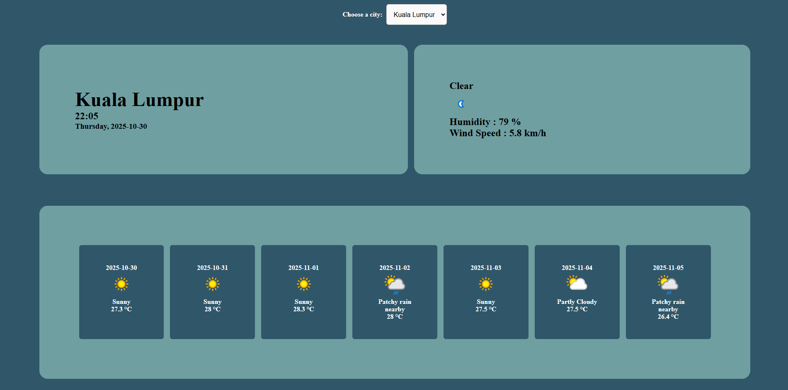

# Weather App

## 🔍 Overview
A responsive web application that fetches live weather data from [WeatherAPI](https://www.weatherapi.com/) based on the user’s selected city.
It displays real-time temperature, humidity, wind speed, and forecast data.
The application is built with JavaScript, HTML, and CSS, and uses a local proxy server to securely handle API requests.

## ✨ Features
- Dislay weather information based on the city selected in the dropdown list (Kuala Lumpur, Selangor, Pulau Pinang, Johor Bahru), include:
  - Live Local Time: Displays the city’s local date and time.
  - Weather Details: Shows temperature, humidity, wind speed, and sky conditions.
  - 7-Day Forecast: Dynamically updates forecast data from WeatherAPI.
- Proxy Integration: Requests are routed through a backend proxy to prevent direct API key exposure.
- Responsive Design: Layout adjusts dynamically for mobile, and desktop screens.

## 🛠️ Tech Stack
- Frontend: HTML5, CSS3, JavaScript (ES6+)
- Backend (Proxy): Node.js / Express (for API relay)
- API Source: WeatherAPI
- Development Tools: VS Code, Live Server

## ⚙️ Project Structure
```
weather-app/
│
├── index.html              # Main HTML file
├── style.css               # Styling and responsive layout
├── index.js                # Core JavaScript (fetch & DOM updates)
├── server.js               # Backend proxy to handle API requests
├──.env                     # Environment variables (API key, port)
├── assets/                 
│
└── README.md               # Project documentation
```

## 🚀 Live Demo
[(Click here for live demo)](https://zen-yee.github.io/Basic-Weather-App/)

## 📸 Screenshots

